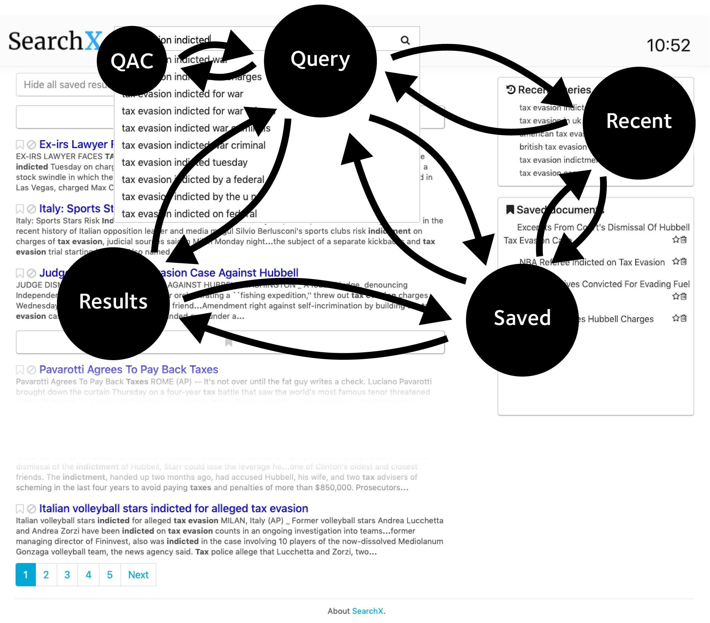

# CSCW Markov Models (Exploratory Analysis)
Exploratory scripts for examining how people use the *SearchX* interface using experimental data from the CSCW experiment.

**Last Update: 2020-06-11**

## Overview
Points to consider:

* We want to see what happens to interactions with the search interface and its widgets.
* How do interactions with different widgets correspond to interactions with the rest of the search interface?
* If there is more content in a widget, does that entail a greater degree of interaction?
* Look at the first five minutes, then the last five minutes?

## Exprimental Interface
To represent interactions over the *SearchX* interface, we use (in this first pass) Markov models, with each state representing a different interface component (i.e. the searcher is currently interacting with a given component in some way), with transition probabilities the liklihood of transitioning from interface component *x* to interface component *y*.

## Data Source

## Required Packages