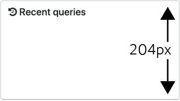
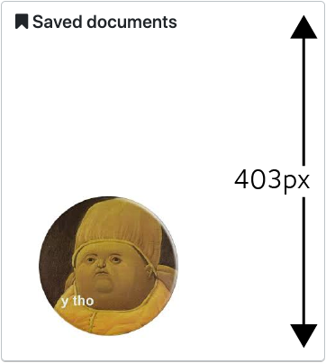

# CSCW Markov Models (Exploratory Analysis)
Exploratory scripts for examining how people use the *SearchX* interface using experimental data from the CSCW experiment.

**Last Update: 2020-06-25**

## Required Software
See [the `requirements.txt` file](https://github.com/maxwelld90/modelling/blob/master/exploratory/cscw-markov/requirements.txt) for the required Python packages. Run this on Python 3.7.x. You also need a MongoDB instance running locally with the interaction logs stored on it.

## Overview
We want to see roughly how behaviours change when interacting with different components on the *SearchX* interface. To start, we limit our exploration using data from an interaction log derived from the independent condition of the CSCW experiment, i.e. participants working solo on a search task. When we look at the data in different ways, what changes in behaviour do we observe? In paricular, we are interested in the number of interactions that take place with the four main components.

Questions we want to consider (I think):
* What are the interaction likelihoods for the main interface components?
* How do interactions with different widgets correspond to interactions with the rest of the search interface?
* If there is more content in a widget, does that entail a greater degree of interaction?
* Do the levels of interaction vary at different points in time during search sessions?

## Exprimental Interface
To represent interactions over the *SearchX* interface, we use (in this first pass) Markov models, with each state representing a different interface component (i.e. the searcher is currently interacting with a given component in some way), with transition probabilities the liklihood of transitioning from interface component *x* to interface component *y*. We keep it simple, considering four main areas in which a participant can interact.

### Interface Components (States)
For the above model, we keep things simple, considering four main components that participants interact with. These are:

*  **Querying**, the state where a participant is *entering a query* into the query box.
*  **Results**, the state where a participant interacts with the *organic results, or ten blue links* that are presented to them.
*  **Recent**, the state where a participant interacts with the *recent queries component*.
*  **Saved**, the state where a participant interacts with the *saved documents component*.

By interact, we mean a hover event. An event where the participant moves their mouse cursor over the component; we have events that capture this. The exception is for the querying component; see *Log Events* below.

### Components of Interest
Note that the *recent queries* component is always placed above the *saved documents* component. Note also of the height of each component; these heights are fixed, and for some reason are different.

Recent Queries             | Saved Documents
:-------------------------:|:-------------------------:
 | 

Does this have an impact? With the data that I have at my disposal, I cannot be sure. However, given that there is generally a higher recorded percentage of interactions on the saved documents widget, *does that happen because it is simply larger, or it is more useful?* We cannot tell for sure with the available data. We also cannot accurately state how many documents/queries fit in each box (without the need for the scrollbars to become active). If a document with a long title is saved, or a long query is issued, the title/query spills onto a new line, pushing items following it down, thus reducing the number of visible items. If we are to analyse the interactions with these widgets more carefully, I think we need to be better at how we control they are presented to participants.

### Log Events
How do we approximate what people are doing at a given time from the log we have?

## Data Source

## Log Events
What events do we use to count the number of interactions? What actually counts as an interaction?

