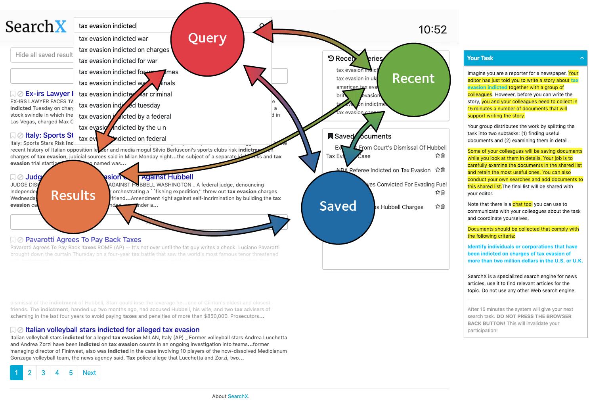
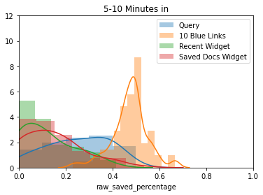

# CSCW Markov Models (Exploratory Analysis)
Exploratory scripts for examining how people use the *SearchX* interface using experimental data from the CSCW experiment.

**Last Update: 2020-06-25**

## Required Software
See [the `requirements.txt` file](https://github.com/maxwelld90/modelling/blob/master/exploratory/cscw-markov/requirements.txt) for the required Python packages. Run this on Python 3.7.x. You also need a MongoDB instance running locally with the interaction logs stored on it.

## Overview
We want to see roughly how behaviours change when interacting with different components on the *SearchX* interface. To start, we limit our exploration using data from an interaction log derived from the independent condition of the CSCW experiment, i.e. participants working solo on a search task. When we look at the data in different ways, what changes in behaviour do we observe? In paricular, we are interested in the number of interactions that take place with the four main components.

Questions we want to consider (I think):
* What are the interaction likelihoods for the main interface components?
* How do interactions with different widgets correspond to interactions with the rest of the search interface?
* If there is more content in a widget, does that entail a greater degree of interaction?
* Do the levels of interaction vary at different points in time during search sessions?

## Exprimental Interface
To represent interactions over the *SearchX* interface, we use (in this first pass) Markov models, with each state representing a different interface component (i.e. the searcher is currently interacting with a given component in some way), with transition probabilities the liklihood of transitioning from interface component *x* to interface component *y*. We keep it simple, considering four main areas in which a participant can interact.

 Fig. 1

### Interface Components (States)
For the above model, we keep things simple, considering four main components that participants interact with. These are:

*  **Querying**, the state where a participant is *entering a query* into the query box.
*  **Results**, the state where a participant interacts with the *organic results, or ten blue links* that are presented to them.
*  **Recent**, the state where a participant interacts with the *recent queries component*.
*  **Saved**, the state where a participant interacts with the *saved documents component*.

By interact, we mean a hover event. An event where the participant moves their mouse cursor over the component; we have events that capture this. The exception is for the querying component; see *Log Events* below.

### Components of Interest
Note that the *recent queries* component is always placed above the *saved documents* component. Note also of the height of each component; these heights are fixed, and for some reason are different.

Recent Queries (2)            | Saved Documents (3)
:-------------------------:|:-------------------------:
 | 

Does this have an impact? With the data that I have at my disposal, I cannot be sure. However, given that there is generally a higher recorded percentage of interactions on the saved documents widget, *does that happen because it is simply larger, or it is more useful?* We cannot tell for sure with the available data. We also cannot accurately state how many documents/queries fit in each box (without the need for the scrollbars to become active). If a document with a long title is saved, or a long query is issued, the title/query spills onto a new line, pushing items following it down, thus reducing the number of visible items. If we are to analyse the interactions with these widgets more carefully, I think we need to be better at how we control they are presented to participants.

### Log Events
How do we approximate what people are doing at a given time from the log we have? As we are looking at hover events, we look for the hover events in the log corresponding to a given event!

**Event**  | **Log Event**
:---------:|:-------------------------:
Querying   | `QUERYSUGGESTIONS_GET`*
Results    | `SEARCHRESULT_HOVERENTER`
Recent     | `QUERYHISTORY_HOVERENTER`
Saved      | `BOOKMARK_HOVERENTER`

These are our events that trigger a change in state. Note that for querying, there is *no hover event for the query box widget*. We have to approximate here; instead, we look for when a query suggestion is requested by the client. This means that the participant is interacting with the query box. For the first instance of a `QUERYSUGGESTIONS_GET` event (they typically occur in blocks, character-by-character), we switch state to querying.

At the moment, times are not being tracked, but if it is worth looking into later on, I will do so. I felt that working out a reliable way to track times was not worth the effort at this first pass. Like any other log, there's lots of weird scenarios that a simple script that tracks a start and end event can't reliably capture!

## Basic Method
To compute the values reported below, we took each of the trigger events listed above (representing changes in state), and began counting the number of occurrences. We could then find the sum (over the four) and computer the percentage of interactions belonging to a specific component. For state-to-state transitions, we also counted the number of times transitions occurred from one state to another, and counted those. Percentages were also computed from these values, and slapped onto a Markov model-style illustration.

## Results
Let's have a look at what I've found. A lot of it is to be expected, but interesting nevertheless. First, we'll have a look at the raw percentage values for interactions that take place over each component, and then move towards splitting these values up to construct a basic model showing the percentage likelihood of switching from one state to another.

We chop the dataset up based on a number of different considerations to see what is going on. Each approach is shown in the table below.

**Type**  | **Description**
:--------:|:-------------------------:
`full`    | The entire search session.
`first5`  | The first five minutes of the search session.
`second5` | From 5-10 minutes into the search session.
`savedX`  | Considering only events that take place when `X` documents have been saved.
`queryY`  | Considering only events that take place when `Y` queries have been issued.

The final two are interesting -- the values of `X` and `Y` dictate how many items are present in the saved documents and recent queries components, respectively. By examining the dataset this way, we can see how interactions vary as the number of items in each of the two components increase.

### Dataset Distributions

Full Dataset (4)               | First Five Minutes (5)           | 5-10 Minutes (6)
:-------------------------:|:----------------------------:|:-----------------------------:
 |  | 

### Interaction Percentages
Given the datasets, what were the interaction values recorded? We could consider things from two perspectives: *(i)* considering each session by itself, meaning we have 72 unique entries, and show those individually, or *(ii)* sum up all of the interactions that take place over all 72 sessions, and treat them as one. We report findings from both approaches.

#### Considering Sessions Individually
Let's consider sessions individually. We have 24 participants, each undertaking 3 search topics, meaning a total of 72 datapoints. While creating a separate Markov model for each would be unnecessary and unweildy, let's instead combine together the complexities of each search session to a single point on a plot. Below is a combined boxplot and swarmplot, with each of the four main interface components represented along the x-axis, with the percentage of time spent interacting within each component shown up the y-axis. As said, each point represents an individual search session, so there will be 72 points per colour.

Full Dataset (7)              | First Five Minutes (8)
:-------------------------:|:-------------------------:
         | 

Saved Documents Component  | `x=[0,2,4,6]`
:-------------------------:|:-------------------------:
 9  |  10
 11  |  12

Recent Queries Component     | `y=[0,2,4,6]`
:---------------------------:|:-------------------------:
 13  |  14
 15  |  16

We can see from the points that generally, a majority of interactions took place within the results, followed by the query components. This is not suprising. The recent queries and saved documents components are the least interacted-with components, with saved documents affording more interactions on average than recent queries.

#### Summing Everything Up

**Type**  | **Query** | **Results** | **RecentQ** | **Saved**
:--------:|:---------:|:-----------:|:-----------:|:---------:
`full`    | `0.25`    | `0.45`      | `0.13`      | `0.18`
`first5`  | `0.37`    | `0.46`      | `0.08`      | `0.09`
`second5` | `0.25`    | `0.45`      | `0.14`      | `0.16`

**No. Saved**  | **Query** | **Results** | **RecentQ** | **Saved**
:-------------:|:---------:|:-----------:|:-----------:|:-----------:
0              |  0.416471 |    0.463529 |   0.112941  | 0.00705882 |
1              |  0.219745 |    0.55414  |   0.159236  | 0.066879   |
2              |  0.170732 |    0.558266 |   0.151762  | 0.119241   |
3              |  0.172757 |    0.591362 |   0.129568  | 0.106312   |
4              |  0.201729 |    0.550432 |   0.103746  | 0.144092   |
5              |  0.172161 |    0.589744 |   0.0989011 | 0.139194   |
6              |  0.208904 |    0.55137  |   0.0719178 | 0.167808   |
7              |  0.173585 |    0.562264 |   0.0679245 | 0.196226   |

**No. Queries**  | **Query** | **Results** | **RecentQ** | **Saved**
:-------------:|:-----------:|:-----------:|:-----------:|:-----------:
0              |    0.717742 |    0.209677 |   0.0241935 | 0.0483871  |
1              |    0.365796 |    0.432304 |   0.0807601 | 0.12114    |
2              |    0.278422 |    0.426914 |   0.12529   | 0.169374   |
3              |    0.272331 |    0.422658 |   0.115468  | 0.189542   |
4              |    0.329341 |    0.422156 |   0.10479   | 0.143713   |
5              |    0.296089 |    0.405028 |   0.106145  | 0.192737   |
6              |    0.296667 |    0.41     |   0.146667  | 0.146667   |
7              |    0.334928 |    0.430622 |   0.129187  | 0.105263   |

### As Content Increases, What Happens?
Another question posed is: *as the content inside the saved documents and recent queries components increases, what happens to the interactions?* To consider this question, we look at the changes in the total percentage of interactions that take place in the four main components as the number of items in the saved documents and recent queries components increases. Note that this first pass controls only the number of items in the two components in isolation; i.e. if we explicitly look at interactions when 4 items are in the saved documents list (`x=4`), there could be a variable number of queries in the recently issued queries comswponent. **Note that the colours don't match up (sorry), it was a pain to get it to change colour in sns.**

So from this plot, we want to look at the orange line first -- which represents the percentage of interactions taking place in the saved documents component, as the number of items in it increases (x axis). This ranges from 0% (at zero documents) to roughly 20% (at seven documents). We generally see an increase as the number of items itself increases. The blue line (recent queries) slowly decreases as the number of saved documents increases. There may be a relationship between the two components -- but I think we need to look at controlling the number of items in both components to draw any meaningful conclusions.

When we look at the second plot, we're looking at what happens when the number of queries increases over time (so more items appear in the recent queries component). One thing that looks a bit weird is why the red line (results) starts at 20%. How can you look at results when there are none (at zero queries)? I think this is an artefact of the search interface; perhaps there's a `
` that stores results that is still present at the beginning -- see the screenshot below. The logger is tracking hovers into that red box. So there's still events being captured. I will need to update the script to remove these events. However, looking at the blue line (interactions with recent queries), we again see a gradual increase in interactions that take place. Interestingly, we see a lower percentage for the orange line (saved documents), meaning fewer interactions take place within the previously saved documents component than we witnessed above.

**tl;dr** We see increases in the interactions within both the saved documents and recent queries components as the number of items within them increases. Both seem to follow a similar trend, although the saved documents component affords a slightly higher rate of increase (at least from a crude visual inspection). We need to do a bit more analysis, controlling what's in BOTH components, to see if one is more *dominant* or *important* than the other, or at least, one that does afford more interactions/attraction.

### Towards Markov-Style Representations
Now, let's break things down a bit more. As the log analysis script parses the log events in chronological order, we can work out what the state is at any current point -- and when an event is reached that triggers a state change (see [Log Events](#log-events) above), we can then work out how many occurrences of state changes from one to another happen in a given dataset. We visualise that here with some basic model representations over the four states.

Similar findings were observed for state transitions over the first x minutes (in terms of transitions between different interface components).

Saved Documents Component  | `x=[0,2,4,6]`
:-------------------------:|:-------------------------:
 21    |  22
 23    |  24

- similar levels of transitions from coomponents to saved documents. zero at the start, after that, gradual increases. For example, from Q to Saved, went from 0, 3.23, 5.71, 8.20. General increase. corresponds with results found above.

Recent Queries Component   | `y=[0,2,4,6]`
:-------------------------:|:-------------------------:
 25    |  26
 27    |  28

## Thoughts
There is evidence to suggest that interactions with the widgets increase as more content appears within them. Over time, there is also evidence to suggest that the components of the interface that participants interact with vary over time.

Regarding the saved documents component:

- It is double the heright of the recent queries component.
- If we increase the size of the component, does that mean we are priming participants into thinking that "hey, this one is more important"?
- Or is this simply due to the fact that in this scenario, it is simply a more useful tool?
- We should take a look at the data of a collaborative search session, and consider interactions on the two components there. Is there a difference?
  - Recent queries are arguably more important for saved documents, perhaps without defined roles?

With recently saved documents and queries controlled, maybe we can get a better idea of what one is more dominant. We may need to control and draw meaningful conclusions.